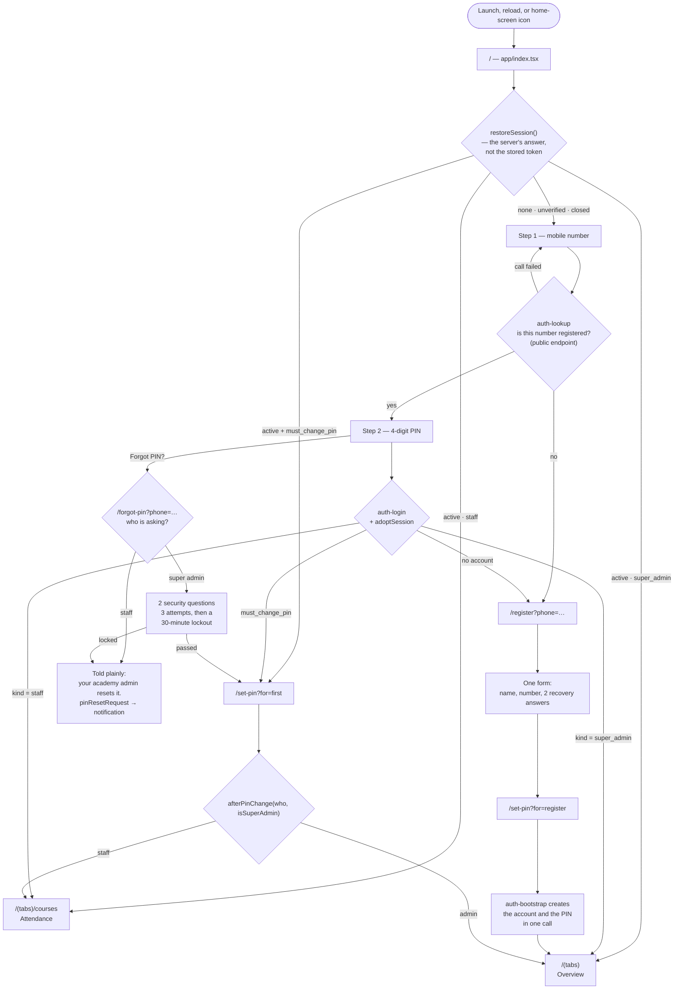
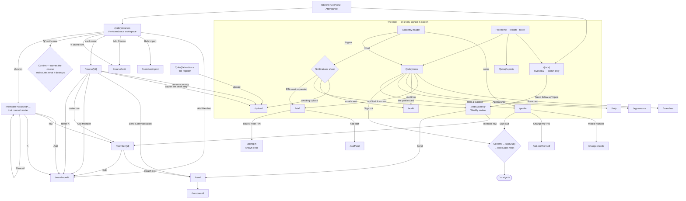
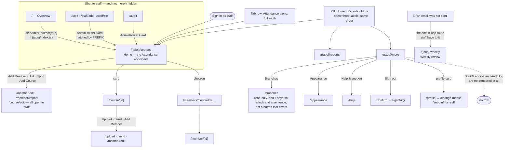
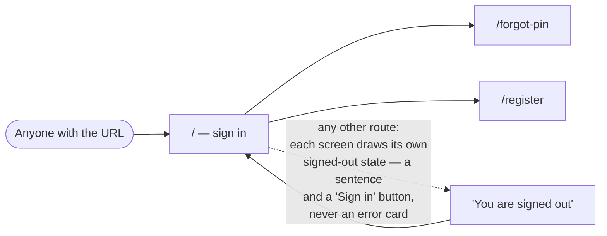

# RosiFit — Navigation Flow by User

**Written 08-Sep-2026.** Read out of the code, not out of the manual: every edge below is a
`router.push` / `router.replace` / `navigate` call, a `<Tabs.Screen>` entry or a guard that
exists in this repo today, and each one is cited to the file and line it came from. Where the
code and an existing register disagree, this document says so rather than repeating the
register.

**Companion documents.** [USER_MANUAL.md](USER_MANUAL.md) §3 describes the chrome in prose for
the person using it; [registers/RBAC_MATRIX.md](registers/RBAC_MATRIX.md) holds what each role
may *do* in the database. This one holds only where each role may *go*, and what stops them.

---

## Contents

1. [The people this app has](#1-the-people-this-app-has)
2. [The door — one entry, four ways through it](#2-the-door--one-entry-four-ways-through-it)
3. [Academy admin — the full map](#3-academy-admin--the-full-map)
4. [Staff — the same map, three doors shut](#4-staff--the-same-map-three-doors-shut)
5. [Signed out — what a visitor can reach](#5-signed-out--what-a-visitor-can-reach)
6. [The two maps side by side](#6-the-two-maps-side-by-side)
7. [Where each guard actually lives](#7-where-each-guard-actually-lives)
8. [Routes nothing navigates to](#8-routes-nothing-navigates-to)
9. [Sources](#9-sources)

---

## 1. The people this app has

**Two roles, one non-role, and one person who never signs in.** `app_users.kind` is
`check (kind in ('super_admin','staff'))` and a partial unique index allows exactly one
undeleted `super_admin` per project, so the product's four-tier vocabulary does not exist here.

| Who | In the database | Where they land | What is withheld |
|---|---|---|---|
| **Academy admin** — the owner, one per academy | `kind = 'super_admin'` | `/(tabs)` — Overview | nothing |
| **Staff** — coaches and front desk | `kind = 'staff'` | `/(tabs)/courses` — Attendance | Overview · Staff & access · Audit log |
| **Signed-out visitor** | no row | `/` — sign in | everything but the door |
| **A member** — the student | `members`, not `app_users` | *never signs in* | the whole app |

*Coach* and *Front desk* are **display labels typed onto a staff record, not roles** —
`ROLE_LABELS` in [src/data/mock.ts](../src/data/mock.ts). They carry identical navigation and
identical database rights. A member has no account, no PIN and no screen: she is reached by
email through a stored template, never by logging in.

**The unknown role is treated as staff.** Every function in
[src/data/access.ts](../src/data/access.ts) takes a plain boolean, and `false` is the safe
answer while `useIdentity` is still resolving — offering a tap that turns out not to have been
hers is the failure that ordering avoids.

---

## 2. The door — one entry, four ways through it

`/` is both the sign-in screen ([app/index.tsx](../app/index.tsx)) and the PWA's `startUrl`, so
every launch, reload and home-screen tap arrives here. It asks the **server** who you are before
it draws anything.

**Four things this diagram is deliberate about.**

- **`unverified` does not resume.** A stored token the server has not confirmed is exactly what
  this flow refuses to trust — but the token stays in storage, so the next visit that reaches
  the server resumes without a PIN ([sessionRestore.ts:57-71](../src/data/sessionRestore.ts#L57-L71)).
- **`closed` is the risk persistence adds, and answers it.** A disabled account used to meet
  `is_active` at every sign-in; a session surviving reloads would otherwise carry it past that
  check indefinitely.
- **A failed lookup never guesses.** `continueDestination` returns `stay`, not `register` —
  answering "not registered" on a dropped connection would send her somewhere she was never
  meant to go ([app/index.tsx:95-124](../app/index.tsx#L95-L124)).
- **Registration is the admin's path only.** Recovery questions exist for `super_admin` alone,
  which is why `/forgot-pin` forks on role before it draws a form.

---

## 3. Academy admin — the full map

Home is **Overview**. Both header tabs, all three pill items, every More row.

**Back, in this app, is a named destination.** Weekly, Members and Attendance live inside the
tab group so they keep the chrome — and that costs them a back stack, because navigating within
a `Tabs` navigator switches the focused tab rather than pushing. So the caller writes down where
it came from in `?from=`, and `safeBackTarget` accepts only an in-app absolute path: a back
button that follows whatever a link said is an open redirect wearing an arrow icon
([src/data/nav.ts:29-41](../src/data/nav.ts#L29-L41)).

---

## 4. Staff — the same map, three doors shut

Identical chrome, identical labels, identical writes. **Home means Attendance instead of
Overview**, and that is the only structural difference the requester asked for.

**Two consequences worth stating plainly.**

1. **A redirect, not a "no access" card — and the choice was made deliberately.** The navigation
   never offers Overview, Staff & access or the Audit log to staff, so arriving at one is a
   stale link or a typed address, and the useful answer is the screen she meant to be on.
   `/member/import` is the opposite case and gets the opposite treatment: bulk import is a
   button she can *see*, so being told why would answer a question she actually asked —
   though since `0050` there is nothing to tell her, because staff may import
   ([AdminOnly.tsx:6-28](../src/components/AdminOnly.tsx#L6-L28)).
2. **Weekly review is all but unreachable for staff.** Its only in-app link is the "Need
   follow-up" figure on Overview — the one tab staff do not have. What remains is the
   *"an email was not sent"* notification, which routes to `/(tabs)/weekly`, and a typed URL.
   This is TD-014's shape, one role over: the register records Weekly as unreachable for
   everybody, which stopped being true when Overview's figure became a link
   ([app/(tabs)/index.tsx:307](<../app/(tabs)/index.tsx#L307>)) and is now true for staff alone.

---

## 5. Signed out — what a visitor can reach

Three screens, and none of them shows academy data.

**`auth-lookup` is the one deliberately unauthenticated capability that reveals anything about
accounts.** Continue must choose between the PIN screen and registration before anybody has
proved anything, so the endpoint is public and answers one boolean for any number asked. It is
therefore a staff-enumeration oracle, accepted knowingly — ADR 016, cost recorded as TD-017. It
returns no name, no `kind`, no `is_active`, and nothing that narrows a PIN guess.

**Signing out resets the root Stack rather than replacing the route.** `/` is Overview's
pathname as well as sign-in's, and expo-router breaks that tie in favour of the group the caller
is already in — so `router.replace('/')` from a tab screen landed on a signed-out Overview
(RC-022). The reset leaves nothing on the stack to come back to, which is also what ending a
session should mean ([access.ts:71-86](../src/data/access.ts#L71-L86)).

---

## 6. The two maps side by side

| | Academy admin | Staff |
|---|---|---|
| **Sign-in lands on** | `/(tabs)` Overview | `/(tabs)/courses` Attendance |
| **Home (pill) goes to** | `/(tabs)` | `/(tabs)/courses` |
| **Header tab row** | Overview · Attendance | Attendance alone, full width |
| **Pill** | Home · Reports · More | Home · Reports · More — *identical* |
| **Overview `/`** | ✅ | ➖ redirected to Attendance |
| **Staff & access `/staff*`** | ✅ | ➖ row not rendered; URL redirected |
| **Audit log `/audit`** | ✅ | ➖ row not rendered; URL redirected |
| **Branches `/branches`** | ✅ read + write | ✅ read; write refused with a sentence |
| **Weekly review `/(tabs)/weekly`** | ✅ via Overview's "Need follow-up" | ⚠ notification or typed URL only |
| **Courses, members, import, upload, send** | ✅ | ✅ — unchanged, since `0050` |
| **Forgot PIN** | 2 security questions → new PIN | told the academy admin resets it |
| **Reports, Appearance, Help, Profile** | ✅ | ✅ |

Nothing about what staff may **write** is reduced by any of the above. The boundary since
`0050_staff_are_not_restricted` (applied 08-Sep-2026) is **the account and its record** —
`app_users`, `audit_logs`, PIN reset, settings, follow-up rules, templates — **not the
register**.

---

## 7. Where each guard actually lives

The chrome and the database say the same thing in two places, and **the chrome does not replace
the policies** — it agrees with them.

| Guard | Lives in | What it does | Backed in the database by |
|---|---|---|---|
| Which tab row you see | [access.ts `tabVisible`](../src/data/access.ts#L48-L50) | drops Overview for staff | — (chrome only) |
| Where Home goes | [access.ts `homeHref`](../src/data/access.ts#L35-L37) | `/(tabs)` or `/(tabs)/courses` | — |
| Overview by URL | [app/(tabs)/index.tsx:133](<../app/(tabs)/index.tsx#L133>) | `useAdminRedirect(true)` | — |
| `/staff*`, `/audit` by URL | [AdminOnly.tsx `AdminRouteGuard`](../src/components/AdminOnly.tsx#L52-L55) | prefix match → replace to Attendance | `app_users_read`, `audit_logs_read` = `is_super_admin()` |
| More's admin rows | [more.tsx:148-150](<../app/(tabs)/more.tsx#L148-L150>) | filters `adminOnly` items | same two policies |
| Branch writes | [branches.tsx:108](../app/branches.tsx#L108) | lock + sentence instead of a control | branch write policies = `is_super_admin()` |
| Every write, any role | — | — | `is_subscription_writable()` — an expired subscription makes the whole product read-only rather than partially broken |

**Why the rule is a module and not five inline `isSuperAdmin ?` expressions.** The shell asks it
in four places — the header tab row, the navigator's pill, the router's pill on a pushed screen,
and More's back arrow — plus a fifth in the guard on the routes those lists stop pointing at.
Five copies of one rule is how the pill and the tab row end up disagreeing about where home is.
They read it from [src/data/access.ts](../src/data/access.ts), and it is covered by
`src/data/access.test.ts` and `src/components/staffShell.test.ts` — the latter fails if a new
`adminOnly` row is added to More without a matching guard.

---

## 8. Routes nothing navigates to

Walked by grepping every `router.push` / `router.replace` / `navigate` / `href` in `app/` and
`src/` against the 30 route files under `app/`. These have no caller anywhere in the app:

| Route | Reachable only by | Recorded as |
|---|---|---|
| `/holiday` | typing the URL | TECH_DEBT — the More row was its only route, removed 05-Sep-2026 on the owner's instruction; migration `0017` and its triggers are still live, so the engine half works and the UI half is unreachable |
| `/offering/edit` | typing the URL | TD-015 — nothing references it but its own `Stack.Screen` line; it is the screen `set_offering_schedule` exists to serve |
| `/(tabs)/attendance` | typing the URL | TD-014 — still no caller |
| `/(tabs)/weekly` | Overview's "Need follow-up" figure (admin), the *not sent* notification, or the URL | TD-014, now **half-stale**: it records Weekly as having no caller at all, which the Overview figure contradicts. True for staff, not for the admin |

**The route inventory in [FEATURE_TRUTH.md](registers/FEATURE_TRUTH.md) is stale** (last
recounted 03-Sep-2026). It claims 33 routes and names four that no longer exist — `match`,
`send/review`, `course/rules`, `templates` — while omitting `member/import`. The tree holds
**30** routes today (33 `.tsx` files under `app/`, less the two `_layout.tsx` and `+html.tsx`,
which is the document shell rather than a route). Correcting that register is a separate, deliberate edit and is
not made here — registers are append/supersede-only, and this document is not the place to
supersede one.

---

## 9. Sources

Every claim above traces to one of these. Nothing was read from memory or from the manual.

- **The role rule** — [src/data/access.ts](../src/data/access.ts) ·
  [src/components/AdminOnly.tsx](../src/components/AdminOnly.tsx) ·
  [src/data/sessionRestore.ts](../src/data/sessionRestore.ts) ·
  [src/data/nav.ts](../src/data/nav.ts)
- **The chrome** — [src/components/AppShell.tsx](../src/components/AppShell.tsx) (`TABS`,
  `NAV_REST`, `navItems`) · [app/(tabs)/_layout.tsx](<../app/(tabs)/_layout.tsx>) ·
  [src/components/Notifications.tsx](../src/components/Notifications.tsx) (`DESTINATION`)
- **The door** — [app/index.tsx](../app/index.tsx) · [app/register.tsx](../app/register.tsx) ·
  [app/forgot-pin.tsx](../app/forgot-pin.tsx) · [app/set-pin.tsx](../app/set-pin.tsx)
- **The screens** — every file under [app/](../app/), read for its navigation calls
- **The permissions behind the navigation** —
  [docs/registers/RBAC_MATRIX.md](registers/RBAC_MATRIX.md), itself read from the migration text
- **The orphans** — [docs/registers/TECH_DEBT.md](registers/TECH_DEBT.md) TD-014, TD-015 and the
  holidays row, re-verified against the code rather than quoted
